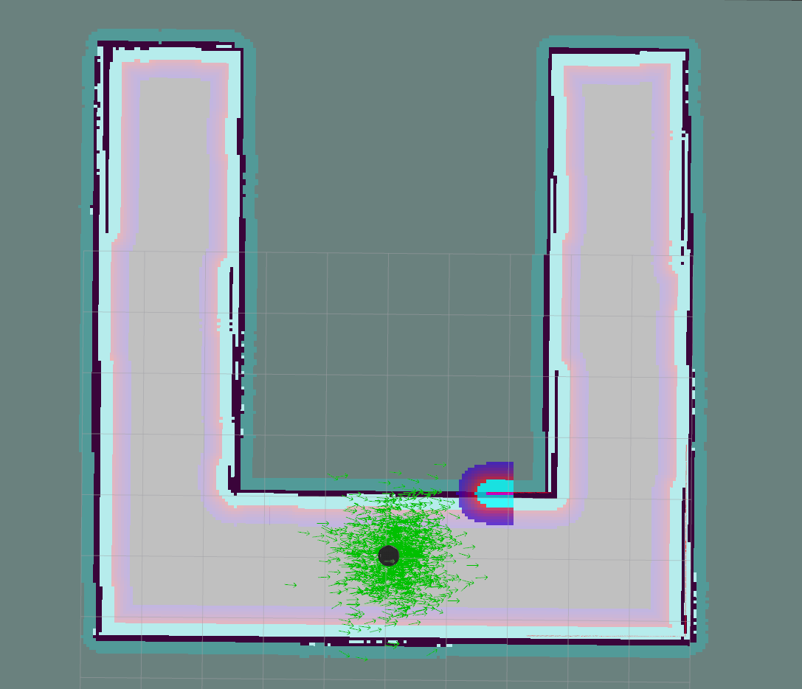

# robond-home-service-robot
Robotics  Engineer Nanodegree Term 2 Project 5 (Final Project).

## Dependencies

To clone the project for the first time,

```
git clone --recurse-submodules https://github.com/xpharry/robond-home-service-robot.git
```

else the command following is to update the latest version,

```
git submodule update
```

For other dependencies, run

```
sudo apt-get update
sudo apt-get install ros-kinetic-navigation ros-kinetic-kobuki*
rosdep -i install <package name>
```

## Structure

Package Tree

Here's a high level overview of how you catkin_ws/src directory should look like:

```
    ├──                                # Official ROS packages
    |
    ├── slam_gmapping                  # gmapping_demo.launch file                   
    │   ├── gmapping
    │   ├── ...
    ├── turtlebot                      # keyboard_teleop.launch file
    │   ├── turtlebot_teleop
    │   ├── ...
    ├── turtlebot_interactions         # view_navigation.launch file      
    │   ├── turtlebot_rviz_launchers
    │   ├── ...
    ├── turtlebot_simulator            # turtlebot_world.launch file
    │   ├── turtlebot_gazebo
    │   ├── ...
    ├──                                # Your packages and direcotries
    |
    ├── world                          # world files
    │   ├── ...
    ├── shellScripts                   # shell scripts files
    │   ├── ...
    ├──rvizConfig                      # rviz configuration files
    │   ├── ...
    ├──wall_follower                   # wall_follower C++ node
    │   ├── src/wall_follower.cpp
    │   ├── ...
    ├──pick_objects                    # pick_objects C++ node
    │   ├── src/pick_objects.cpp
    │   ├── ...
    ├──add_markers                     # add_marker C++ node
    │   ├── src/add_markers.cpp
    │   ├── ...
    └──
```

## Customization

Tune parameters in 'gmapping_demo.launch'.

Add markers in 'view_navigation.launch'.

## Results

My World built in Gazebo:


My map obtained by SLAM GMapping:


